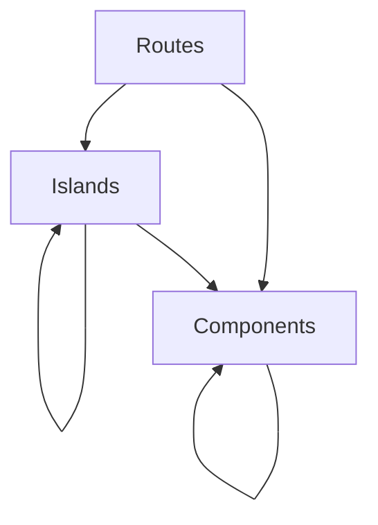

# AGENTS.md

This file defines day-to-day implementation standards for Fresh/Preact work in
this repository.\
Canonical product and governance rules live in
[.specify/memory/constitution.md](.specify/memory/constitution.md).\
If this file conflicts with the constitution, follow the constitution.

## Source of Truth and Precedence

When guidance conflicts, use this precedence order:

1. [.specify/memory/constitution.md](.specify/memory/constitution.md)
2. Repo-enforced checks and automation (`deno.json`,
   `.github/workflows/cd.yaml`)
3. This file (`AGENTS.md`)
4. Generated or auxiliary guidance (`.specify/templates/*`, `.cursor/rules/*`,
   command helper docs)

If generated guidance is stale or contradictory, treat it as non-authoritative
and align work to the constitution plus repo-enforced tooling. Update stale
guidance in the same or next change where practical.

## Composition Rules (Authoritative)

| Parent            | May include/import                      |
| ----------------- | --------------------------------------- |
| `src/routes/`     | `src/components/`, `src/islands/`       |
| `src/islands/`    | `src/components/`, other `src/islands/` |
| `src/components/` | other `src/components/` only            |

Hard rule: `src/components/` can NEVER include/import from `src/islands/`.

## Data access (Drizzle ORM)

- Prefer **relational reads** using `db.query.<table>.findFirst` / `findMany`
  with `where`, `orderBy`, `columns`, and nested `with` as described in the
  [Drizzle relational query API (RQB v2)](https://orm.drizzle.team/docs/rqb-v2).
- Keep **`db.select` / the SQL query builder** for aggregates (`count`,
  `groupBy`, `sql` fragments), `selectDistinct`, joins that are not modeled as
  relations, and other cases where the relational API is a poor fit.
- Reuse shared query helpers (for example `listAdminCategories` in
  `src/lib/adminReads.ts`) when multiple call sites need the same read.

## Fresh 2.x and Preact Standards

- Use Fresh 2.x conventions and APIs (for example `App` from `fresh` and route
  handlers using `handler(ctx)`).
- Keep route and island code in the current `src/` layout used by this repo
  (`src/routes/`, `src/islands/`, `src/components/`).
- `components/` and non-island route markup are SSR-only building blocks.
- Client behavior MUST live only in `islands/`.

## Client Reactivity and SSR Boundaries

- Islands MUST use `@preact/signals` for client reactivity.
- Do not use `preact/hooks` (`useState`, `useEffect`, `useRef`, `useMemo`,
  `useCallback`, etc.) in application code.
- Do not move DB access, auth flows, passkey verification, or quiz-selection
  business logic into client-side code.

## Code Design Principles

- Apply Clean Code practices: descriptive names, small focused
  functions/modules, and straightforward control flow.
- Apply SOLID principles pragmatically for TypeScript modules, route handlers,
  and component/island boundaries.
- Apply DRY: consolidate duplicated business rules, normalization behavior, and
  quiz-selection logic when duplication can cause divergence or inconsistent
  behavior.
- Use descriptive identifiers. Single-letter variables and parameters are
  disallowed except `_` for intentionally unused bindings.

## Security and Admin Mutation Safeguards

- `/admin/*` routes and admin mutations MUST preserve passkey-backed session
  requirements.
- Authentication changes MUST preserve challenge verification and credential
  counter update semantics.
- Session cookies for admin auth MUST preserve secure invariants used by the app
  (`HttpOnly`, `Secure`, and current SameSite policy).
- Destructive admin operations MUST require an explicit confirmation step before
  data removal.

## Verification and Completion Gates

- Stack baseline: Deno, Fresh 2.x, TypeScript, Preact islands,
  `@preact/signals`, Tailwind CSS 4, Drizzle ORM.
- Before considering work complete, run checks appropriate to the touched scope:
  - `deno fmt --check`
  - `deno lint .` (or `deno task check`, which includes lint and checks)
  - `deno check`
  - `deno task test` for affected logic/routes/auth/persistence paths
- CI also runs `deno audit`; dependency/security regressions should be treated
  as blocking unless explicitly risk-accepted.
- Verification is mandatory and proportional to risk:
  - pure deterministic logic changes require unit tests
  - route, auth, and persistence changes require integration coverage where
    practical, otherwise an explicit manual validation plan
  - mobile-facing behavior requires explicit mobile validation evidence
- Compliance checks happen at two points: during planning and before work is
  considered complete.

## Spec, Plan, and Tasks Discipline

- For feature work using the Specify workflow, keep spec/plan/tasks artifacts
  aligned with constitution checks.
- Specs MUST explicitly capture quiz-identity impact, server/client boundaries,
  mobile validation, security/admin implications, and verification approach.
- Plans MUST include a constitution check that covers deterministic identity,
  server-first boundaries, SSR versus island boundaries, `@preact/signals`
  usage, code quality principles (Clean Code/SOLID/DRY), and Deno quality gates.
- Tasks MUST be organized into independently testable user stories and include
  required verification work (automated and/or explicit manual validation).

## Constitution Reminders for Feature Work

- Quiz identity MUST stay deterministic and encoded in the shareable quiz path.
- Player-local preferences MUST NOT change quiz selection behavior.
- Player UX is mobile-first by default.
- Player-facing data hydration MUST remain minimal.
