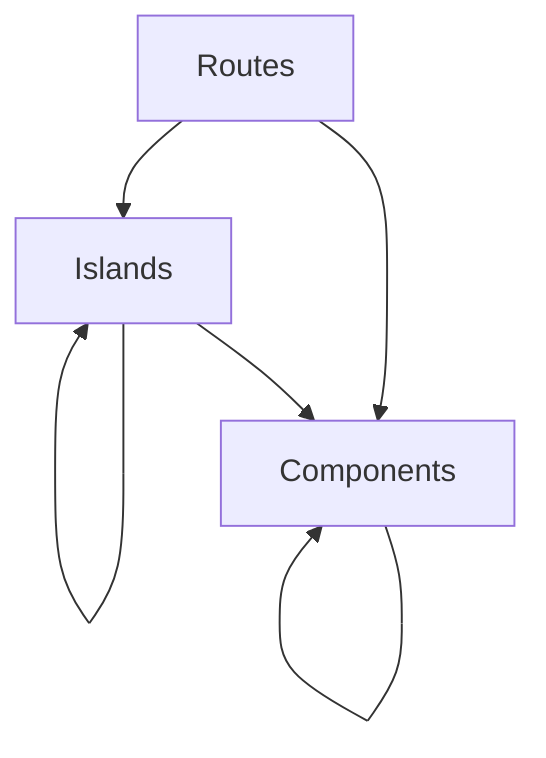

# AGENTS.md

Canonical implementation standards for the Musical Quiz App (`fruiz`). Every
contributor and every automated agent works from this file. Subsystem-level
behavior lives in [`specs/`](./specs/); commands and Claude-specific entry hints
live in [`CLAUDE.md`](./CLAUDE.md). Skills for the Deno/Fresh stack live in
[`.agents/skills/`](./.agents/skills/).

## Source of truth and precedence

When guidance conflicts, use this precedence order:

1. This file (`AGENTS.md`) — authoritative implementation standards.
2. Repo-enforced checks and automation (`deno.json`,
   `.github/workflows/cd.yaml`).
3. Subsystem specs under `specs/` — describe behavior of individual functional
   areas.
4. `CLAUDE.md` — Claude Code session pointers; never overrides this file.

If a subsystem spec contradicts the rules below, fix the spec — this file is the
canon for _how_ code is written; specs describe _what_ each subsystem does.

## Core principles

These are non-negotiable. Every change MUST satisfy each principle or document
an explicit waiver in the PR description.

### I. Deterministic quiz identity

Every input that influences which tracks appear in a quiz MUST be encoded in the
shareable quiz path and MUST reproduce the same ordered track list for the same
inputs. Player-local preferences (such as `replayLimit`) MUST remain outside
quiz identity and MUST NOT change track selection. Quiz generation logic MUST
stay deterministic, side-effect free, and auditable from route input through
final ordered tracks.

_Rationale:_ shareability is the product's core promise. A copied quiz URL is
only trustworthy if it always recreates the same quiz for every player and every
device.

### II. Server-first data boundaries

Database access, track selection, passkey verification, session management, and
all sensitive business rules MUST run server-side. Client islands MAY manage
interaction and local state, but they MUST receive only the minimum serialized
data required for the active experience. Raw database access, credential
material, and quiz selection logic MUST NEVER move into browser code.

_Rationale:_ the architecture depends on Fresh SSR plus islands to keep secrets,
data access, and bundle size under control while preserving a simple client
runtime.

### III. Mobile-first playability

Player-facing flows MUST be designed and validated for phone-sized screens
first. UI work MUST provide touch-friendly controls, avoid hover-only
interactions, preserve keyboard access where applicable, and use semantic HTML
plus labels for interactive elements. Audio interactions MUST respect browser
gesture requirements instead of relying on autoplay.

_Rationale:_ the primary experience is a mobile web quiz. Desktop support is
additive, not the design baseline.

### IV. Passkey-secured authentication

All authenticated routes (`/account/*`, `/admin/*`) MUST require a validated
session backed by the `sessions` table. The `/admin/*` subset additionally
requires `users.admin === true` on the loaded user. Passwords MUST NOT be
introduced. Authentication changes MUST preserve WebAuthn challenge
verification, credential counter updates, and `HttpOnly` + `SameSite=Strict`
session cookies (plus `Secure` in non-development deployments). Destructive
admin operations MUST present an explicit confirmation step before data is
removed.

_Rationale:_ admin access controls the quiz corpus and must remain
phishing-resistant and operationally safe without expanding the attack surface
with weaker auth patterns.

### V. Verification is mandatory

Changes to deterministic logic, URL encoding, normalization, authentication, or
persistence MUST include automated verification proportional to risk. Pure logic
MUST have unit tests. Route handlers, auth flows, and admin CRUD changes MUST
have integration coverage or a documented manual validation plan when automation
is impractical. Subsystem specs MUST state how compliance with these principles
will be checked before implementation starts.

_Rationale:_ this project mixes deterministic game logic, browser behavior, and
security boundaries. Regressions are easiest to prevent when verification is
defined up front.

### VI. Maintainable code and engineering discipline

Code MUST follow Clean Code practices (clear naming, small focused units,
straightforward control flow), SOLID design principles where they apply to
TypeScript modules and components, and DRY: duplicated business rules or
selection logic MUST be consolidated when divergence would cause inconsistent
behavior or obscure shared invariants.

Variable, parameter, and function names MUST be descriptive. Single-letter
identifiers MUST NOT be used for variables or parameters; the sole exception is
`_` for intentionally unused bindings where the language or framework convention
requires a binding name.

_Rationale:_ the codebase is shared between server routes, islands, and data
access. Opaque names and duplicated logic raise defect rates and slow safe
changes to quiz identity and auth boundaries.

### VII. Components are SSR-only; islands own client behavior

Modules under `src/components/` MUST be used exclusively for server-side
rendering. They MAY use TypeScript and Preact to build markup on the server, but
they MUST NOT include client-side JavaScript behavior: interactive event
handlers that require hydration, client-side hooks or effects, client-managed
state or signals meant to run in the browser, or browser-only APIs (`window`,
`document`, and similar). Non-island UI in `src/routes/` MUST follow the same
restriction. Only `src/islands/` modules (and Fresh-designated island
entrypoints) MAY contain code intended to execute in the browser with those
capabilities.

**Signals, not hooks.** Island code MUST use `@preact/signals` for client
reactivity (state, derived values, and effects the framework documents for
signals). Code MUST NOT import `preact/hooks` or use hook APIs such as
`useState`, `useEffect`, `useRef`, `useCallback`, or `useMemo`. This project
does not use the Preact hooks programming model in application code.

_Rationale:_ Fresh relies on islands for client bundles and interactivity.
Smuggling client behavior into `components/` obscures boundaries, inflates or
misplaces hydration, and weakens the server-first model this app depends on.

## Stack baseline

The canonical implementation stack is:

| Layer          | Choice                                                |
| -------------- | ----------------------------------------------------- |
| Runtime        | Deno                                                  |
| Framework      | Fresh (`jsr:@fresh/core`)                             |
| Routing        | Fresh file-system routing (SSR + islands)             |
| Build          | Vite via `@fresh/plugin-vite`                         |
| Styling        | Tailwind CSS (`@tailwindcss/vite`)                    |
| Language       | TypeScript with `strict` + `noUncheckedIndexedAccess` |
| UI             | Preact + `@preact/signals`                            |
| ORM            | Drizzle ORM (`drizzle-orm/node-sqlite`)               |
| Database       | SQLite at `data/quiz.db`                              |
| WebAuthn       | `@simplewebauthn/server` + `@simplewebauthn/browser`  |
| Cookie helpers | `@std/http` (`getCookies` / `setCookie`)              |

Architectural changes that replace or substantially bypass this stack MUST be
justified in the spec / PR.

Fresh app entry is [`src/main.ts`](./src/main.ts), which wires `staticFiles()`,
`trailingSlashes("never")`, and `app.fsRoutes()` against the workspace `State`
defined in [`src/utils.ts`](./src/utils.ts). Vite root is `src/`; build output
is `_fresh/`.

## Composition rules (authoritative)

| Parent            | May import                              |
| ----------------- | --------------------------------------- |
| `src/routes/`     | `src/components/`, `src/islands/`       |
| `src/islands/`    | `src/components/`, other `src/islands/` |
| `src/components/` | other `src/components/` only            |

Hard rule: `src/components/` MUST NEVER import from `src/islands/`. This is
enforced by review and exercised by
`tests/integration/routes/composition_boundary_test.ts`.

Server-only code (DB access, auth flows, quiz selection, passkey verification,
session helpers) MUST live under `src/db/`, `src/lib/`, `src/middlewares/`, or
route `handler` functions. It MUST NOT move into islands or client bundles.

## Data access (Drizzle ORM)

- Prefer **relational reads** with `db.query.<table>.findFirst|findMany` using
  `where`, `orderBy`, `columns`, and nested `with`. See
  [`src/db/relations.ts`](./src/db/relations.ts) and the
  [Drizzle relational query API](https://orm.drizzle.team/docs/rqb-v2).
- Use **`db.select` / the SQL query builder** for aggregates (`count`,
  `groupBy`, `sql` fragments), `selectDistinct`, joins not modeled as relations,
  and other cases where the relational API is a poor fit.
- Reuse shared query helpers (e.g. `listAdminCategories` in
  `src/lib/adminReads.ts`) when multiple call sites need the same read.
- The Drizzle singleton and the `DB` type are exported from
  [`src/db/db.ts`](./src/db/db.ts). `FRUIZ_DEBUG=true` enables query logging.

## Client reactivity and SSR boundaries

- Islands MUST use `@preact/signals` for client reactivity (`signal`,
  `computed`, `effect`, `useSignal`, `useSignalEffect`, etc.).
- Do NOT import `preact/hooks` or use `useState`, `useEffect`, `useRef`,
  `useMemo`, `useCallback`, or other hook APIs anywhere in application code.
- Do NOT move DB access, auth flows, passkey verification, or quiz-selection
  business logic into client-side code.
- When an island needs to react to changing props inside `useSignalEffect`,
  bridge the prop into a local signal — raw props are not reactive dependencies.
  Pattern: `const sig = useSignal(prop); sig.value = prop;` then read
  `sig.value` inside the effect.

## Code design principles

- Apply Clean Code: descriptive names, small focused functions/modules,
  straightforward control flow.
- Apply SOLID pragmatically for TypeScript modules, route handlers, and
  component/island boundaries.
- Apply DRY: consolidate duplicated business rules, normalization behavior, and
  quiz-selection logic when duplication can cause divergence or inconsistent
  behavior.
- Use descriptive identifiers. Single-letter variables and parameters are
  disallowed except `_` for intentionally unused bindings.
- Lint rules `no-non-null-assertion` and `eqeqeq` are enforced on top of the
  `fresh`, `jsx`, `workspace`, and `recommended` tags (see `deno.json`).

## Security and admin mutation safeguards

- `/account/*` and `/admin/*` routes require a validated session loaded via the
  session middleware (`src/middlewares/session.ts`). `/admin/*` additionally
  requires `users.admin === true` (enforced through `src/lib/adminSession.ts`).
- Authentication changes MUST preserve WebAuthn challenge verification and
  credential `counter` updates.
- Session cookies MUST be `HttpOnly`, `SameSite=Strict`, and `Secure` outside
  development. Cookie reads and writes go through `@std/http` helpers, not
  hand-rolled string parsing.
- Destructive admin operations (delete track, delete category, delete passkey,
  logout) MUST require an explicit confirmation step in the UI.
- Quiz routes MUST keep a strict split between **path** parameters that define
  quiz identity and **query parameters / localStorage** that define player-local
  preferences. Invalid category slugs or malformed difficulty encodings MUST
  redirect to a recoverable entry point rather than render a broken page.

## Verification and completion gates

Before considering work complete, run the checks appropriate to the touched
scope:

- `deno fmt --check`
- `deno lint .`
- `deno check` for static analysis on touched code
- `deno task check` bundles fmt + lint + typecheck and is the single gate when
  changes are broad
- `deno task test` for affected logic/routes/auth/persistence paths

CI (`.github/workflows/cd.yaml`) additionally runs `deno audit`; treat
audit/lint/test failures as blocking unless explicitly risk-accepted in the PR.

Verification is mandatory and proportional to risk:

- Pure deterministic logic changes require unit tests (see `tests/unit/`).
- Route, auth, and persistence changes require integration coverage where
  practical (`tests/integration/`); otherwise an explicit manual validation
  plan.
- Mobile-facing behavior requires explicit mobile validation evidence.

DB lives at `data/quiz.db`. Create `data/` before the first `deno task db:sync`.

## Spec discipline

Subsystem behavior lives in single-file specs under `specs/` (one numbered file
per piece of functionality). New behavioral work uses
[`specs/_template.md`](./specs/_template.md) as the starting shape and updates
or adds the relevant numbered spec. Specs MUST capture:

- Purpose and the user journeys served.
- Behavior — including invariants, edge cases, and error / redirect paths.
- Data model and serialization contracts.
- Key files / modules the subsystem touches.
- Constraints inherited from the core principles above.
- Verification approach (unit / integration / manual).
- Open questions and known risks.

Behavior changes that span subsystems MUST update each affected spec in the same
change.

## Reference

- [`specs/`](./specs/) — subsystem specs (start at
  [`specs/README.md`](./specs/README.md)).
- [`.agents/skills/`](./.agents/skills/) — Deno / Fresh skills used by AI
  agents.
- [`CLAUDE.md`](./CLAUDE.md) — Claude Code session pointer with the command
  table.
