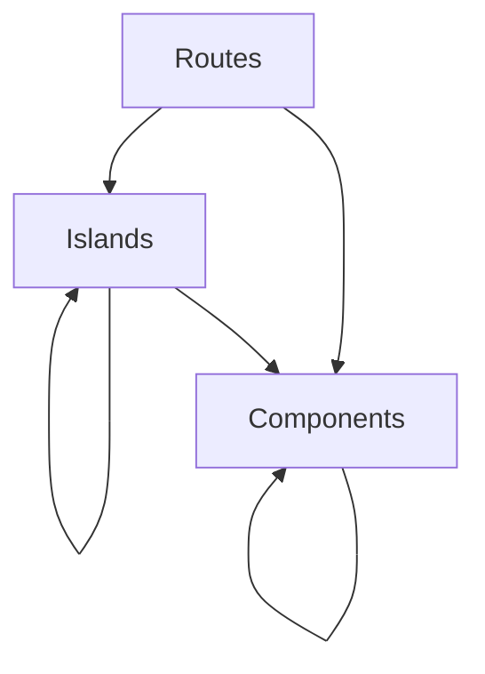

# AGENTS.md

This file defines day-to-day implementation standards for Fresh/Preact work in
this repository.\
Canonical product and governance rules live in
[.specify/memory/constitution.md](.specify/memory/constitution.md).\
If this file conflicts with the constitution, follow the constitution.

## Composition Rules (Authoritative)

| Parent            | May include/import                      |
| ----------------- | --------------------------------------- |
| `src/routes/`     | `src/components/`, `src/islands/`       |
| `src/islands/`    | `src/components/`, other `src/islands/` |
| `src/components/` | other `src/components/` only            |

Hard rule: `src/components/` can NEVER include/import from `src/islands/`.

## Fresh 2.x and Preact Standards

- Use Fresh 2.x conventions and APIs (for example `App` from `fresh` and route
  handlers using `handler(ctx)`).
- Keep route and island code in the current `src/` layout used by this repo
  (`src/routes/`, `src/islands/`, `src/components/`).
- `components/` and non-island route markup are SSR-only building blocks.
- Client behavior belongs only in `islands/`.

## Client Reactivity and SSR Boundaries

- Islands must use `@preact/signals` for client reactivity.
- Do not use `preact/hooks` (`useState`, `useEffect`, `useRef`, `useMemo`,
  `useCallback`, etc.) in application code.
- Do not move DB access, auth flows, passkey verification, or quiz-selection
  business logic into client-side code.

## Constitution Reminders for Feature Work

- Quiz identity must stay deterministic and encoded in the shareable quiz path.
- Administration routes and mutations must keep passkey-backed session
  requirements.
- Player UX is mobile-first by default.
- Verification is mandatory and proportional to risk (tests and/or explicit
  validation plan).

## Tooling and Code Quality Gates

- Stack baseline: Deno, Fresh 2.x, TypeScript, Preact islands,
  `@preact/signals`, Tailwind CSS 4, Drizzle ORM.
- Before considering work complete, run checks appropriate to the touched scope:
  - `deno task check`
  - or `deno fmt --check` + `deno check`
- Use descriptive names. Single-letter identifiers are disallowed except `_` for
  intentionally unused bindings.
